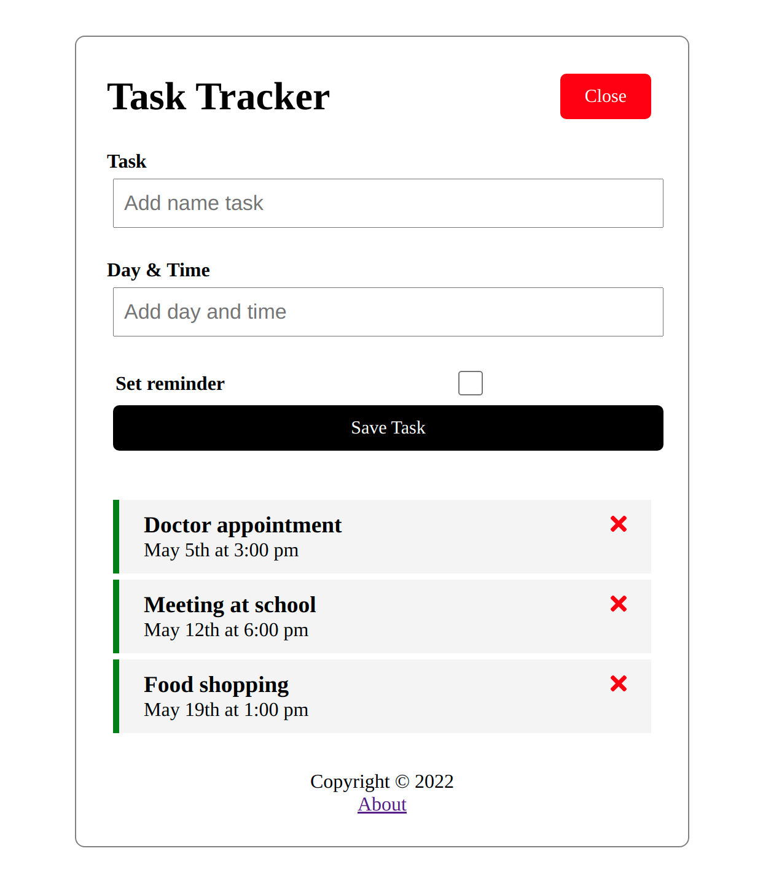

# TaskTracker

This project show a simple task tracker base on `bradtraversy` angular crash course.
The principal aim is to practice some common task on Angular.

## Development server

- Run `ng serve` for a dev server. Navigate to `http://localhost:4200/`. The app will automatically reload if you change any of the source files.
- Run `json-dev-server` to run the REST API to let the system interact with the tasks.
